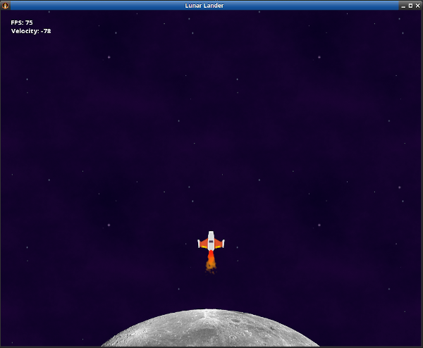

# kojo-gaming
This is the Gaming extension for Kojo.

Here are some of the high-level features of kojo-gaming:
- It has a simple to use (with school-children being a part of the target audience) entity component system with the following features:
  - animated sprites with rendering based on textures, texture atlases, and particle systems.
  - simple physics (kinematics).
  - collision detection and response.
  - world boundary behaviors (bouncing, wrapping, etc).
  - and more...
- It is hardware accelerated for good performance - based on OpenGL via LibGDX and LWJGL (the tech used by Minecraft!)
- Games made in Kojo can be exported to [Desktop or Mobile](https://github.com/litan/kojo-gaming-template).

You can play with some example games here:  
https://github.com/litan/gaming_fundamentals

And here's a quick screenshot of a [game made with kojo-gaming](samples/lunar-lander/lander.kojo):

To start playing, check out [the latest release](https://github.com/litan/kojo-gaming/releases)!
